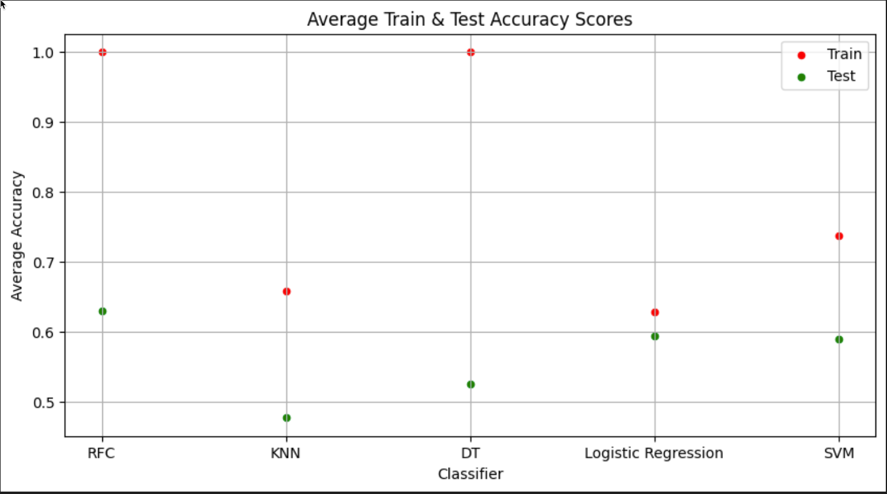

# Predicting Earthquake Impact

## Summary

Using a combination of United States Geological Survey (USGS) earthquake data and International Soil Reference and Information Centre (ISRIC) soil bulk density data, we develop a model to predict the impact (intensity) of earthquakes as measured by the Modified Mercalli Intensity (MMI) scale.  
To define our target feature, we divide our data points into three categories defined by the `mmi` value of each data point.  
After evaluating Random Forest Classifier, Decision Tree Classifier, K-Nearest-Neighbor Classifier, Multinomial Logistic Regression Classifier, and Support Vector Machine Classifier, we determine that the Random Forest Classifier with hyperparameter `max_depth=6` performs the best on our data.  
Using that classifier we build a model that returns an average balanced accuracy score of 0.62 for the test data set.

## Overview

This project aims to predict the impact of earthquakes using historical seismic data and soil bulk density information. Using various properties of earthquakes, such as magnitude, depth, location, and various geological features, in addition to soil bulk density, we evaluate various machine learning (ML) classifiers to determine which one is best suited to model the potential impact of an earthquake.  
We include soil bulk density data in our analysis since the composition of the soil, besides the properties of an earthquake, has a large influence on the impact an earthquake has [^1].  
This project integrates data retrieval, preprocessing, and model evaluation to deliver predictive capabilities and insights into seismic hazards.

## Process

1. **Data Retrieval**: Fetch earthquake data from a United States Geological Survey (USGS) rest API at https://earthquake.usgs.gov/fdsnws/event/1 and soil density data from a `.csv` file (`wosis_latest_bdwsod.csv`) downloaded from ISRIC at https://data.isric.org/geonetwork/srv/eng/catalog.search#/metadata/2f99e111-183c-11e9-aba8-a0481ca9e724.
2. **Data Preprocessing**: Clean and prepare data for analysis, including handling missing values and feature engineering.  
We use the Modified Mercalli Intensity (mmi) scale[^2] to determine the impact an earthquake might have.
3. **Exploratory Data Analysis (EDA)**: Exploration of the dataset to understand distributions, relationships, and patterns.
4. **Predictive Modeling**: Implement and evaluate various machine learning classifiers using the balanced accuracy score as metric to select the best one to build a model to predict earthquake impacts.

## Classifiers Evaluated

- **Random Forest Calssifier (RFC)**: Captures complex interactions in the data and assesses feature importance, providing predictions by aggregating multiple decision trees.
- **Multinomial Logistic Regression**: Performs multinomial classification to separate data points into different classes.
- **Support Vector Machine (SVM)**: Handles complex classification tasks and ensures robust separation in high-dimensional spaces.
- **K Nearest Neighbors (KNN)**: Classifies data points based on the proximity of similar data points.
- **Decision Tree (DT)**: Classifies data using series of binary decisions organized into a hierarchical tree structure.

## Files
### Data Files 
All data files are contained in the `Resources` folder. We used the following data files:
 * `wosis_latest_bdwsod.csv` - Soil bulk density data file.
 * `earthquake_data.csv` - Raw dataset. File combines earthquake data retrieved from USGS and soil bulk density data retrieved from ISRIC.
 * `earthquake_data_standardized.csv` - Standardized/Scaled and reduced dataset used for analysis. Contains only features we will use to build our models. Based on `earthquake_data.csv`. 

### Main Program Files
This section lists the main program files used. They are contained in folder `ProgramFiles`. Details are provided in another section below. The main program files are:
* `retrieve_data.ipynb` - Retrieves earthquake and soil data and creates `earthquake_data.csv`.
* `preprocess_data.ipynb` - Takes `earthquake_data.csv`, preprocesses the data and creates `earthquake_data_standardized.csv` as output.
* `evaluate_classifiers.ipynb` - Takes `earthquake_data_standardized.csv` as input and evaluates five different classifiers to determine which one is best suited to build our model.
* `earthquake_model.ipynb` - Uses pipelines to build the model to predict earthquake intensity.

### Utility Program Files
These files contain utility functions. They are contained in the `ProgramFiles` folder.
* `optimization_utilities.py` - Used in `evaluate_classifiers.ipynb`. Utility functions for evaluating classifiers.
* `pipeline_utilities.py` - Used in `earthquake_model.ipynb`. Utility functions for preprocessing, splitting data, and building models in production pipeline.

### Exploratory Program and Data Files
We performed a bunch of exploratory evaluations of different classifiers. The corresponding program files are contained in the `ProgramFiles/Exploratory` folder. Here is a list of these files:
* `lr_model_predictions.ipynb` - Preliminary evaluation of Mutinomial Logistic Regression Classifier.
* `lr_model_optimizations.ipynb`- Another preliminary evaluation of Mutinomial Logistic Regression Classifier.
* `svm_model_predictions.ipynb` - Preliminary evaluation of Support Vector Machines Classifier.
* `svm_model_optimization.ipynb` - Another preliminary evaluation of Support Vector Machines Classifier.
* `rfc_model_optimizations.ipynb` - Preliminary evaluation of Random Forest Classifier.
* `rfc_reduced_model_optimizations.ipynb` - Preliminary evaluation of Random Forest Classifier using reduced feature set.
* `knn_model_optimization.ipynb` - Preliminary evaluation of K-Nearest_neighbors Classifier.
* `PSHA_DSHA_model_predictions.ipynb` - Preliminary evaluation of Probabilistic Seismic Hazard Analysis (PSHA) and Deterministic Seismic Hazard Analysis (DSHA) models.

We also created a preliminary data file. It is contained in the `Resources/Exploratory` folder.
* `earthquake_data_reduced.csv` - A data file that contains the feature and target columns used to evaluate classifiers and build our model but before those features are scaled. This data file is no longer needed.

### Documentation
* README.md - Project overview and detailed account of the data retrieval, preprocessing, exploratory data analysis, classifier evaluations, and model building steps. Also lists all files created.

## Details of Data Collection, EDA, and Preprocessing
### Retrieve Earthquake and Soil Data:
1. Retrieve Earthquake data using these filters 
   * Start date: 1/1/1995, end date: 12/31/2023.
   * Location: Contiguous United States as defined by minimum and maximum longitudes and latitudes.
   * Minimum earthquake mangintude: 3.0
2. Retrieve Soil Density Data (given by longitude and latitude) and filter to just US data using the same minimum and maximum longitudes and latitudes used to filter the earthquake data.
3. Calculate an average soil bulk density from the different soil layers given in the original data.
4. Combine earthquake and soil bulk density data by finding the soil bulk density record with the nearest longitude and latitude to the longitude and latitude of a given earthquake record. 
5. Save combined earthquake and soil bulk density data in the data file `earthquake_data.csv`.
### Data Pre-Processing
1. Retrieve and read earthquake data from `earthquake_data.csv`.
2. Check data types.
3. Drop rows with `NaN` values.
4. Assess the effect of dropping rows with `NaN` values by comparing the data distribution for each numerical feature before and after dropping rows with `NaN` values.  
**Result**: Distributions do not change substantially, so it is safe to drop rows with `NaN` values.
5. Since we are using `mmi` as our target feature, calculate correlations between `mmi` and all other numerical features.
6. Use correlation and feature definitions to identify features that are also metrics for the impact of an earthquake.
7. Drop columns identified in step 6 to prevent data leakage. Also, drop columns that are irrelevant.
8. Add a column with different `mmi` categories. We define three categories of earthquakes depending on their maximum `mmi` value.
   * **Weak**: Earthquakes with `mmi` score of less than 4. Assigned numerical value of 0.
   * **Moderate**: Earthquakes with an `mmi` score between 4 and less than 5. Assigned numerical value of 1.
   * **Strong**: Earthquakes with an `mmi` score of 5 or higher. Assigned numerical value of 2.
9. Check how many data points fall into each category to make sure categories contain roughly an equal number of data points.  
**Result**: Categories are reasonably balanced since
   * Weak category contains 352 data points.
   * Moderate category contains 353 data points.
   * Strong contains 252 data points.
10. Drop the original `mmi` column to prevent data leakage.
11. Scale all data using Standard Scaler.  
    **Note**: We used the Standard Scaler instead of the scaler based on minimum and maximum values because none of our data is bound by an interval.  
12. Save data to csv `earthquake_data_standardized.csv`.
13. Run preliminary Random Forest Classifier model on scaled, reduced, and cleaned data to assess feasability of building a model with the given data and determine which features might be dominant.  
**Result**: Achieved a balanced test accuracy score of 0.658 which looks promising. However, model is overfitting since the balanced train accuracy score is 1.0.  
No set of features is dominant.

## Details of Model Evaluation and Tuning
We use the balanced accuracy score of the test data set as the metric to evaluate the performance of the different models.
During our initial exploration of the performance of different models, we noticed that the performance was quite sensitive to the values of the `random_state` seed variable. Since the selection of the best performing model should not depend on the randomly chosen `random_state` variable, we performed model evaluations and tuning with five different values (of 1, 7, 13, 29, 42) for the `random_state` variable. We then used the average of the balanced accuracy scores over the different values of the `random_state` variable to evaluate the performance of each model.  
We used the following classifiers utilizing the full feature set to build models:
* Random Forest,
* K-Nearest_Neighbors,
* Decision Tree,
* Multinomial Logistic Regression, and
* Support Vector Machine.

For each model we split the data into train and test data sets and calculated average balanced accuracy scores for the train and test data sets as described above.  
Based on the balanced test accuracy score, we picked the three best performing models for further optimization and tuning. Those models were
* Random Forest - It had the best balanced test accuracy score (of 0.630) but with a balanced train accuracy score of 1.0 it was overfitting the train data.
* Multinomial Logistic Regression - It had the second best balanced test accuracy score (of 0.594) and the smallest difference between balanced train and test accuracy scores (of 0.628 to 0.594) indicating the least overfitting of the train data.
* Support Vector Machine - It had the third best balanced test accuracy score (of 0.589) with a still relatively small difference between balanced train and test accuracy scores (of 0.737 to 0.589).
Not only are the balanced test accuracy scores of these models the best, but they are also within each of the models variation in metrics when picking different values for the `random_state` variable.  
Further reasons for discarding the Decison Tree and the KNN classifier are
* Low balanced test accuracy for both, 0.525 for Decision Tree and 0.477 for KNN.
* A balanced train accuracy score of 1.0 for the Decision Tree indicating large overfitting of the train data for this model.

Next, we addressed the overfitting of the Random Forest Classifier model. A standard way to address overfitting is to reduce the number of features in the model. We used two approaches to find a set of features that would result in an acceptable (i.e., > 0.6) balanced accuracy score for the test data and a balanced accuracy score for the train data of substantially less than 1.0. Those approaches were
* P-values and
* PCA.
Again, we performed our analysis with the five different `random_state` seed values mentioned above.
### Result of P-Value Analysis
1. Depending on the seed value the size of the p-values and their order varied.
2. We had to consistently remove 29 out of 30 features for the balanced accuracy score for the test data to drop below 1.0.  
Therefore we concluded that using p-values to reduce the overfitting of the Random Forest Classifier model was unsuccessful.
### Result of PCA
We varied the number of components for the PCA from 2 to the number of features minus 1 and did not find that the balanced accuracy for the train data dropped below 1.0.  
Therefore we concluded that using PCA to reduce the overfitting of the Random Forest Classifier model was unsuccessful as well.

Next, we turned to hyperparameter tuning. We performed hyperparameter tuning on all three of our best models. Again we used the different `random_state` seeds listed above to mitigate its effect on the classifier evaluation.

### Result of Hyperparameter Tuning for Random Forest Classifier
We first performed hyperparameter tuning on the `max_depth` parameter. We varied the `max_depth` parameter from 1 to a numkber that would result in a balanced accuracy score of 1.0 for the train data.  
We found that the balanced accuracy score of the train data was dependent on the value of the `max_depth` parameter. This let to the conclusion, that by picking a suitable value for `max_depth`, we could control the overfitting of the Random Forest classifier.  
For our further analysis of the Random Forest Classifier, we settled on a value of `max_depth=6`. It seemed a good compromise between an acceptable balanced accuracy score of the test data (larger than 0.6) and a relatively small difference between the balanced accuracy scores between train and test data (minimizing overfitting of the train data).

Keeping `max_depth=6` fixed, we used a randomized search (`RandomizedSearchCV`) to find best fit values for the following hyperparameters:
* `n_estimators`,
* `max_features`,
* `min_samples_split`,
* `min_samples_leaf`, and
* `bootstrap`.

We found that the best fit values varied depending on the `random_state` seed variable. Since the performance of the Random Forest Classifier should not depend on the (arbitrary) selection of the `random_state` variable, we decided not to tune any of the hyperparameters except `max-depth`.

### Result of Hyperparameter Tuning for Multinomial Logistic Regression Classifier
Using a randomized search (`RandomizedSearchCV`), we attempted to find best fit values for the following Multinomial Logistic Regression Classifier hyperparameters:
* `C` and
* `max_iter`.

As for the Random Forest Classifier, we found that the best fit values varied depending on the `random_state` seed variable. We therefore decided not to tune any of the hyperparameters of this classifier.

### Result of Hyperparameter Tuning for Support Vector Machine Classifier
Using a randomized search (`RandomizedSearchCV`), we attempted to find best fit values for the following SVM Classifier hyperparameters:
* `C`,
* `kernel`, and
* `gamma`.

As we found for the previous two classifiers above, we observed that the best fit values varied depending on the `random_state` seed variable. We therefore decided not to tune any of the hyperparameters of this classifier.

## Challenges
We encountered the following challenges:
* We were unable to increase the balanced accuracy score for the test data beyond 0.6-0.65, failing to reach the given target of 0.75 or above.
* The lack of geological and soil science domain knowledge made it challenging to interpret the geological features of an earthquake. This handicapped our selection of the relevant features.
* Finding soil composition data.
* Location of `mmi` measurements were not available. We therefore used the soil data for a location that was closest to the earthquake location which might or might not be the same location at which the `mmi` was taken.
* Persistent overfitting of the Random Forest Classifier. Unfortunately, it was the classifier with the best balanced accuracy score.
* We found a dependency of the classifier performance on the `random_state` seed variable. We mitigated this challenge by evaluating the classifiers for different `random_state` values and averaging over the results.
* One of our team members dropped out of the class.

## Conclusions
We determined that a model built using the Random Forest Classifer with hyperparameter `max-depth=6` performed the best on average using the balanced accuracy score of the test data as a metric.  
Unfortunately, we were unable to reach the target accuracy score of 0.75 with our model. Our model acchieved an average accuracy score of 0.62.  
However, we were able to address the overfitting of the Random Forest Classifier by tuning the `max_depth` hyperparameter.

## Future Work
Future work would need to center on improving the accuracy of the model by
* Improving domain knowledge of the geological properties of earthquakes. This would inform the selection of relevant geological features.
* Correlate the soil bulk density data location more closely with the location of the `mmi` measurement.
* Further fine-tuning the model by slightly varying the `max_depth` parameter away from 6 and evaluating the Multinomial Logistic Regression classifier more closely.  
We started to build a pipeline to further explore this improvement but did not have enough time to complete it.
* Evaluating earthquake specific models such as PSHA (Probabilistic Seismic Hazard Assessment) and DSHA (Deterministic Seismic Hazard Analysis).

## Authors

Christoph Guenther  
Ashwini Kumar

************************************************************************

## Licenses
* USGS data is in the U.S. public domain[^3].
* ISRIC data is in the U.S. public domain[^4].

## Footnotes

[^1]: Nolan, Joe (May 6, 2022). *The Effects of Soil Type on Earthquake Damage*, WSRB website, https://www1.wsrb.com/blog/the-effects-of-soil-type-on-earthquake-damage, accessed on 6/10/2024.

[^2]: Earthquake Hazards Program. *The Modified Mercalli Intensity Scale*, USGS website, https://www.usgs.gov/programs/earthquake-hazards/modified-mercalli-intensity-scale, accessed on 6/10/2024.

[^3]: Information Policies and Instructions. *Copyrights and Credits*, USGS website, https://www.usgs.gov/information-policies-and-instructions/copyrights-and-credits as accessed on 6/10/2024.

[^4]: USAGOV. *Learn about copyright and federal government materials*, USAGOV website, http://www.usa.gov/publicdomain/label/1.0/ as accessed on 6/11/2024.